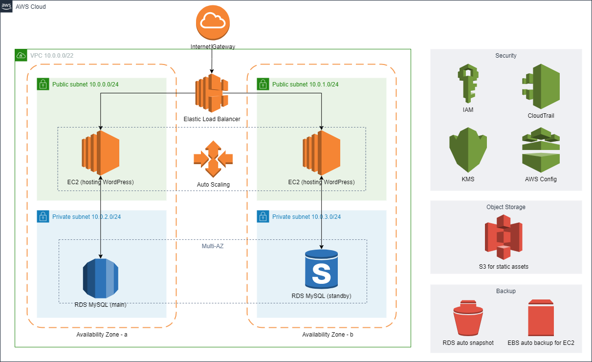

# cloud-architecture-diagram-with-IaC
A collection of cloud architecture diagrams and the corresponding IaC templates.

## Prerequisites 
1. Ensure your working environment has configured with the cloud provider and IaC provider you're going to use, e.g. AWS and Terraform
2. In vars.tf, the variable public_key is a placeholder. Remember to create a pair of public & private keys and use your own public key. 

## How to Use
1. In diagrams/, select an architecture diagram you plan to use, e.g. aws-scalable-wordpress-terraform.drawio.png
2. Use the file name to find the corresponding directory, e.g. aws-scalable-wordpress-terraform/
3. Check vars.tf and confirm the variables are desired. 
4. Run the template, which will call the dependencies automatically.

## Diagrams
### aws-scalable-wordpress-terraform
